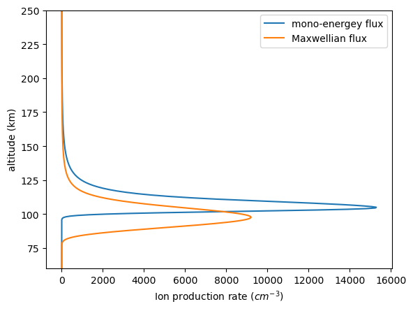

# ionprod
This small package calculates ion production rates of precipitating electrons using a parametrization model developed by [Fang et al.,(2010)](https://doi.org/10.1029/2010GL045406). 

To run the test example, one needs to install the [pymsis](https://swxtrec.github.io/pymsis/index.html) library of the neutral atmospheric model.

